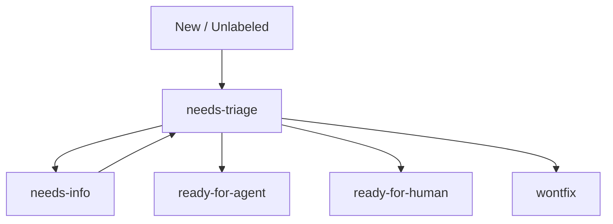

# Agent Configuration

## Issue Tracker

**Type:** Local markdown files in `.scratch/`

**Format:** Each issue is a `.md` file with frontmatter:

```markdown
---
id: <sequential number>
title: <title>
created: <ISO timestamp>
category: bug | enhancement
state: needs-triage | needs-info | ready-for-agent | ready-for-human | wontfix
summary: <one-line description>
---

# <title>

<issue body>
```

**State machine:**



**Label mapping (canonical role → actual label):**

| Role | Label String |
|------|--------------|
| `bug` | `bug` |
| `enhancement` | `enhancement` |
| `needs-triage` | `needs-triage` |
| `needs-info` | `needs-info` |
| `ready-for-agent` | `ready-for-agent` |
| `ready-for-human` | `ready-for-human` |
| `wontfix` | `wontfix` |

## Skills

### triage

**Skill:** `triage` — Triage issues through a state machine driven by triage roles.

Use `/triage` to invoke. The skill reads:
- `AGENT-BRIEF.md` (bundled with skill) — how to write durable agent briefs
- `OUT-OF-SCOPE.md` (bundled with skill) — how the `.out-of-scope/` knowledge base works

Every triaged issue carries exactly one category role (`bug` | `enhancement`) and one state role. State transitions:
- `needs-triage` → `needs-info`, `ready-for-agent`, `ready-for-human`, or `wontfix`
- `needs-info` → back to `needs-triage` once reporter replies
- Maintainer can override at any time

Quick state override: if maintainer says "move #42 to ready-for-agent", trust them and apply the role directly.

## Domain Docs

**Single context:** `CONTEXT.md` at repo root

**ADR directory:** `docs/adr/` at repo root

These are consulted during triage to understand domain language and prior decisions.
